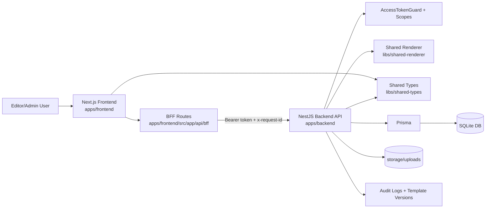

# Pinnacle Mailer Architecture

## Assessment Context and Problem Framing

This assessment was scoped as an email operations and governance problem, not only a component-editing exercise.

Primary risks identified:

- fragmented template ownership causing inconsistent customer communications,
- high blast radius from shared-content changes without clear impact visibility,
- weak rollback and change history for incident recovery,
- insecure integration patterns where credentials or tokens can leak into less trusted clients,
- limited traceability for who changed what and when.

The resulting architecture emphasizes controlled change workflows, secure trust boundaries, and operational recovery mechanisms. Header and footer reuse is an important capability, but it sits within a broader system designed for safe, auditable, and scalable email operations.

## Goals

- Centralize header and footer management for all templates.
- Keep each template body unique and editable by non-technical users.
- Support media upload and reuse with safe email-friendly output.
- Provide version-safe publishing and rollback for controlled change management.
- Preserve auditability and actor attribution for operational accountability.
- Enforce strict authentication boundaries between browser workflows and protected APIs.

## Stack

- Monorepo: Nx (organizes multiple apps/libs in one repo with shared tooling and build workflows)
- Frontend: Next.js (the web UI layer for admin/editor experiences and browser-facing routes)
- Backend: NestJS (the server API layer that handles business logic, auth, and protected operations)
- Persistence: Prisma + SQLite (database access layer plus a local relational database for stored app data)
- Shared rendering: `libs/shared-renderer` (reusable rendering logic that composes consistent email output across templates)

## Architecture Diagram

This architecture enforces a strict trust boundary: browser requests pass through the BFF, and protected business operations execute in the backend behind scope checks.

## Core Flow

1. Editor updates template body blocks.
2. Preview composes `header + body + footer` using shared renderer.
3. Save/publish calls backend validation and persistence.
4. Any shared layout update can be impact-assessed across templates.
5. Roadmap: migrate from SQLite to PostgreSQL for enterprise-scale concurrency and performance.
6. Roadmap: continue frontend UI/UX and reliability hardening for larger operator teams.

## Why this scales well beyond 45 templates

- Shared layouts avoid duplicated edits (one layout change can propagate safely across many templates).
- Templates are versioned for rollback safety (teams can publish fast and recover quickly if needed).
- Audit logs track all key mutations (every critical change has traceability for governance and incident response).
- Media assets are reusable and centrally managed (assets are uploaded once and reused across campaigns).
- BFF-mediated auth boundaries reduce credential leakage risk while retaining per-user attribution (secure browser-to-API workflows at scale).
- 45 templates is only an early milestone (the model supports much larger growth, especially with the planned move from SQLite to PostgreSQL for enterprise-scale performance and concurrency).

## Near-Term Evolution

- Database evolution: move to PostgreSQL to improve concurrent writes, operational tooling, and long-term data growth characteristics.
- Storage evolution: keep current local upload flow while preserving the abstraction to move media to object storage later without rewriting editor workflows.
- Product evolution: improve editing ergonomics, validation feedback, and resilience for day-to-day content operations.

## Assessment Outcomes

- Security posture improved through scoped client auth, session hardening, lockout controls, and request correlation.
- Operational resilience improved through publish/rollback lifecycle and deterministic demo reset workflows.
- Delivery velocity improved through reusable building blocks (layouts, media assets, preview pipeline) that reduce duplicated effort.
